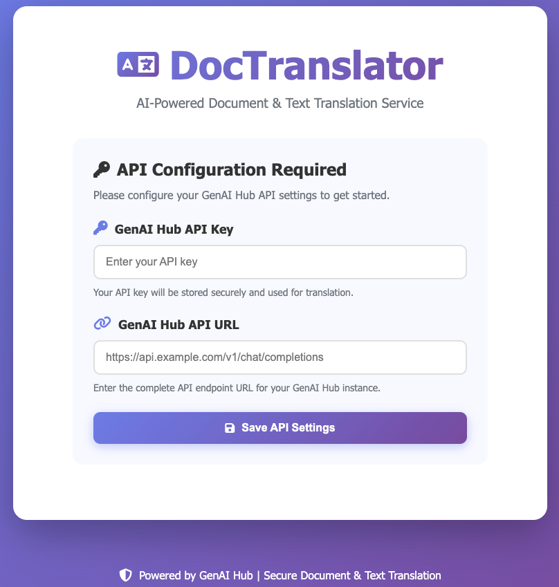

# DocTranslator / LangTranslator

DocTranslator / LangTranslator is a web-based translation service that uses the GenAI HUB API to translate text and files including PowerPoint (.pptx), Word (.docx), Excel (.xlsx), and PDF documents.

## 🎯 Two Translation Modes

### 📄 Document Translation (DocTranslator)
- Translate PPTX, DOCX, XLSX, and PDF files
- Preserve original formatting and layout

### 💬 Text Translation (LangTranslator)
- Real-time text translation
- **Automatic language detection** 🔍
- Text-to-speech functionality 🔊
- Translation history with CSV export (UTF-8 BOM)

## UI Screenshots

### API Configuration Screen (First Launch)


### Main UI (Document Translation Mode)


### Main UI (Text Translation Mode)


## 🚀 Features

- 📄 **Intuitive UI**: Familiar interface similar to popular translation services
- 📄 **Multi-format Support**: Translate PPTX, DOCX, XLSX, and PDF files
- 🤖 **AI-Powered**: Supports models available on GenAI HUB
- 🌐 **Web Interface**: Clean and responsive UI with real-time progress display
- ⚡ **PDF Processing**: High-quality PDF conversion with LibreOffice integration
- 🐳 **Containerized**: Easy development and deployment with Docker

## 🎯 Supported Languages

- English (en)
- Japanese (ja)
- Korean (ko)
- Chinese (zh)
- French (fr)
- German (de)
- Spanish (es)
- Hindi (hi)
- Vietnamese (vi)
- Thai (th)

## 📋 Requirements

### Required Software
- Docker (Rancher Desktop, etc.)
- GenAI Hub API URL
- GenAI Hub API Key

## 🚀 Quick Start (For Users)

### Using GitHub Container Registry Image

1. **Pull Docker Image**:
```bash
docker pull ghcr.io/kotaokayama/doctranslator:latest
```

2. **Start Container**:
```bash
docker run -d -p 8000:8000 --name doctranslator ghcr.io/kotaokayama/doctranslator:latest
```
- If you want to change the port for accessing the application, please modify only the port number on the left side (host side)

3. **Access Application**:
- Open http://localhost:8000 in your browser
- Configure API Key and API URL on first launch

4. **Stop Container**:
```bash
docker stop doctranslator
```

5. **Start Container (Subsequent Times)**:
```bash
docker start doctranslator
```

### Using Docker Compose (Recommended)

1. **Create docker-compose.yml**:
```yaml
version: '3.8'

services:
  doctranslator:
    image: ghcr.io/kotaokayama/doctranslator:latest
    container_name: doctranslator
    ports:
      - "8000:8000"
    volumes:
      - ./uploads:/app/uploads
      - ./downloads:/app/downloads
      - ./logs:/app/logs
      - doctranslator-data:/app/data  # Database persistence
    restart: unless-stopped
    environment:
      - TZ=Asia/Tokyo

volumes:
  doctranslator-data:
```

2. **Start Container**:
```bash
docker-compose up -d
```

3. **Access Application**:
- Open http://localhost:8000 in your browser
- Configure API Key and API URL on first launch

## 🚀 Quick Start (For Developers)

### Using Docker (Recommended)

1. **Clone Repository**:
```bash
git clone https://github.com/kotaokayama/DocTranslator.git
cd DocTranslator
```

2. **Configure Environment Variables**:
```bash
cp .env.example .env
# Edit .env to adjust debug settings as needed
# API Key and API URL can be configured via UI on first launch
```

3. **Start Application**:
```bash
# Build Docker image
docker-compose -f docker-compose.dev.yml build

# Start application
docker-compose -f docker-compose.dev.yml up

# Or use make command
make start
```

4. **Access Application**:
- Open http://localhost:8000 in your browser
- Configure API Key and API URL on first launch

### Local Installation

1. **Clone and Setup**:
```bash
git clone https://github.com/kotaokayama/DocTranslator.git
cd DocTranslator
```

2. **Create Virtual Environment**:
```bash
python -m venv venv
source venv/bin/activate  # Windows: venv\Scripts\activate
```

3. **Install Dependencies**:
```bash
pip install -r requirements.txt
pip install -r requirements-dev.txt
```

4. **Configure Environment**:
```bash
cp .env.example .env
# Edit .env as needed
```

5. **Start Server**:
```bash
uvicorn app.main:app --reload
```

## 📁 Project Structure

```
DocTranslator/
├── app/                          # Application code
│   ├── main.py                   # FastAPI application
│   ├── config.py                 # API configuration management
│   ├── init_db.py                # Database initialization
│   ├── schema.sql                # Database schema
│   ├── core/                     # Core business logic
│   │   ├── translator.py         # Document translation logic
│   │   └── text_translator.py    # Text translation logic
│   ├── static/                   # Static files
│   │   ├── css/style.css
│   │   ├── js/app.js
│   │   ├── index.html
│   │   └── favicon.svg
│   └── utils/                    # Utility functions
│       └── language_detector.py  # Language detection (text translation only)
├── docker/                       # Docker configuration
│   ├── Dockerfile                # Production
│   └── Dockerfile.dev            # Development
├── tests/                        # Test files
├── downloads/                    # Download files
├── uploads/                      # Upload files
└── logs/                         # Log files
```

## 🧪 Testing

### Running Tests
```bash
# Run all tests
make test

# Run specific test file
pytest tests/unit/test_translator.py

# Run with coverage report
pytest --cov=app tests/ --cov-report=html

# Run tests in Docker
docker-compose -f docker-compose.dev.yml exec document-translator pytest
```

## 🔧 Configuration

### Environment Variables

Manage environment variables in `.env` file:

- `GENAI_HUB_API_KEY`: API Key (configurable via UI)
- `GENAI_HUB_API_URL`: API URL (configurable via UI)
- `DEBUG`: Enable debug mode (default: false)
- `LOG_LEVEL`: Logging level (default: INFO)
- `MAX_FILE_SIZE`: Maximum upload file size (default: 100MB)
- `UPLOAD_TIMEOUT`: Upload timeout in seconds (default: 300)

### Docker Configuration

Development:
```bash
# Build Docker image
docker-compose -f docker-compose.dev.yml build

# Start application
docker-compose -f docker-compose.dev.yml up
```

Production:
```bash
# Build Docker image
docker-compose build

# Start application
docker-compose up
```

## 🐛 Troubleshooting

### Common Issues

1. **API Configuration Issues**:
- Verify API Key and API URL are correctly configured
- Check API Key permissions
- Verify API URL format (e.g., https://api.anthropic.com/v1/chat/completions)

2. **PDF Conversion Failures**:
- Verify LibreOffice is installed
- Check logs for specific errors
- Verify file permissions

3. **Docker-related Issues**:
- Verify Docker Desktop is running
- Check container logs
- Try rebuilding the container

4. **Text Translation Language Detection Not Working**:
- Input sufficient text length (minimum 10 characters recommended)
- Check browser console for errors (F12 key)

5. **Text-to-Speech Not Working**:
- Verify browser supports Speech Synthesis API (latest Chrome, Firefox, Safari, Edge)
- Verify target language voice is installed on the system

### Debugging

1. **View Logs**:
```bash
# Docker logs
docker-compose -f docker-compose.dev.yml logs -f

# Application logs
tail -f logs/app.log
```

2. **Check Container Status**:
```bash
docker-compose -f docker-compose.dev.yml ps
```

## 📜 License

This project is licensed under the MIT License. See the LICENSE file for details.

## 👥 Contributing

1. **Create New Branch**:
```bash
git checkout -b feature/new-feature-name
```

2. **Make Changes**:
- Follow coding style
- Add tests for new features
- Update documentation

3. **Test Changes**:
```bash
make test
make lint
make format
```

4. **Submit Pull Request**:
- Describe changes
- Reference related issues
- Request team member review

## 📞 Support

If you encounter any issues, please create a GitHub Issue.