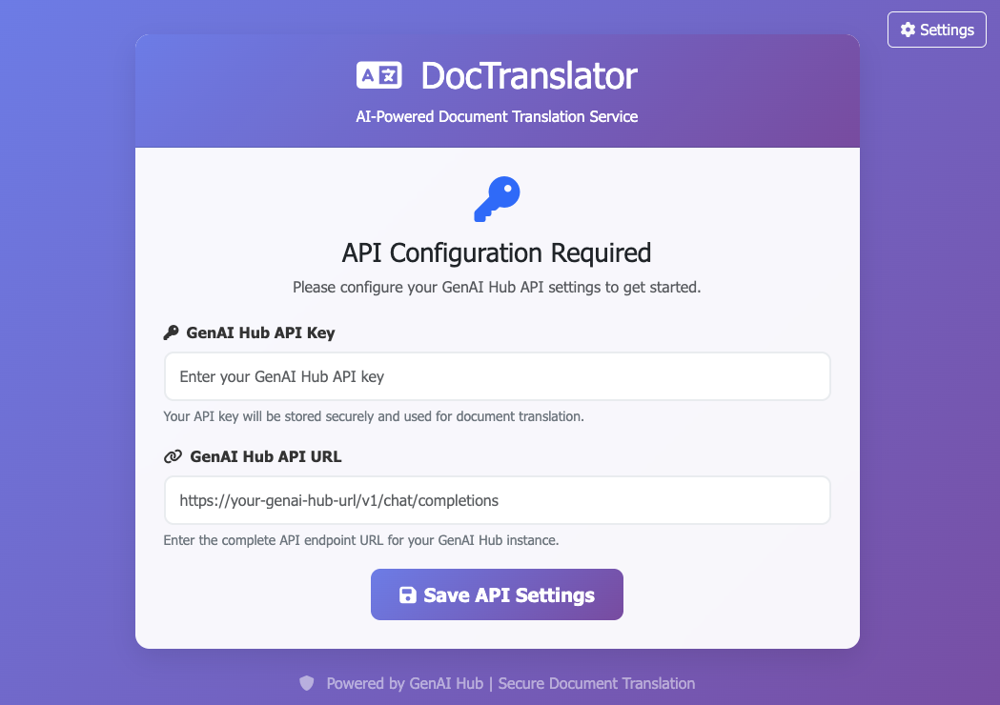
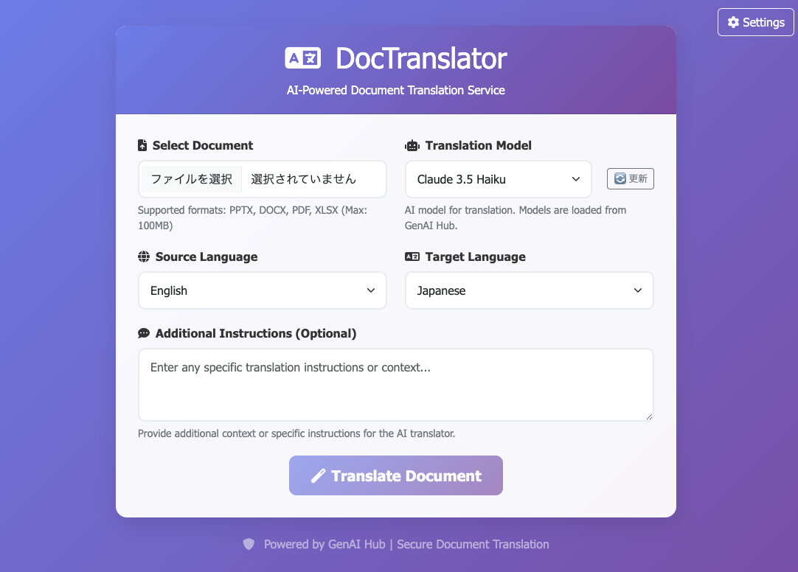

# DocTranslator

DocTranslator is a web-based document translation service that uses the Claude API to translate PowerPoint (.pptx), Word (.docx), and PDF files.

## UI Screenshots

### API Configuration Screen (First Launch)


### Main UI Screen


## 🚀 Features

- 📄 **Multi-format Support**: Translate PPTX, DOCX, and PDF files
- 🤖 **AI-Powered**: Multiple Claude models (Claude 4 Sonnet, 3.7 Sonnet, 3.5 Sonnet V2, 3.5 Haiku)
- 🌐 **Web Interface**: Clean and responsive UI with real-time progress display
- ⚡ **PDF Processing**: LibreOffice integration for high-quality PDF conversion
- 🐳 **Containerized**: Easy development and deployment with Docker

## 🎯 Supported Languages

- English (en)
- Japanese (ja)
- Korean (ko)
- Chinese (zh)
- French (fr)
- German (de)
- Spanish (es)
- Hindi (hi)

## 📋 Requirements

### Required Software
- Docker (e.g., Rancher Desktop)
- Claude API Key

## 🚀 Quick Start (For Users)

### Using GitHub Container Registry Image

1. **Pull Docker Image**:
```bash
docker pull ghcr.io/kotaokayama/doctranslator:latest
```

2. **Start Container**:
```bash
docker run -d -p 8000:8000 --name doctranslator \
  -v $(pwd)/uploads:/app/uploads \
  -v $(pwd)/downloads:/app/downloads \
  -v $(pwd)/logs:/app/logs \
  ghcr.io/kotaokayama/doctranslator:latest
```

3. **Access Application**:
- Open http://localhost:8000 in your browser
- Configure Claude API Key and API URL on first launch

4. **Stop Container**:
```bash
docker stop doctranslator
```

5. **Start Container (Subsequent Times)**:
```bash
docker start doctranslator
```

### Using Docker Compose

1. **Create docker-compose.yml**:
```yaml
version: '3.8'

services:
  doctranslator:
    image: ghcr.io/kotaokayama/doctranslator:latest
    ports:
      - "8000:8000"
    volumes:
      - ./uploads:/app/uploads
      - ./downloads:/app/downloads
      - ./logs:/app/logs
    restart: unless-stopped
    environment:
      - TZ=Asia/Tokyo
```

2. **Start Container**:
```bash
docker-compose up -d
```

3. **Access Application**:
- Open http://localhost:8000 in your browser
- Configure Claude API Key and API URL on first launch

## 🚀 Quick Start (For Developers)

### Using Docker (Recommended)

1. **Clone Repository**:
```bash
git clone https://github.com/kotaokayama/DocTranslator.git
cd DocTranslator
```

2. **Set Environment Variables**:
```bash
cp .env.example .env
# Edit .env as needed
# API Key and API URL can be configured through UI on first launch
```

3. **Start Application**:
```bash
# Build Docker image
docker-compose -f docker-compose.dev.yml build

# Start application
docker-compose -f docker-compose.dev.yml up

# Or using make command
make start
```

4. **Access Application**:
- Open http://localhost:8000 in your browser
- Configure Claude API Key and API URL on first launch

### Local Installation

1. **Clone and Setup**:
```bash
git clone https://github.com/kotaokayama/DocTranslator.git
cd DocTranslator
```

2. **Create Virtual Environment**:
```bash
python -m venv venv
source venv/bin/activate  # Windows: venv\Scripts\activate
```

3. **Install Dependencies**:
```bash
pip install -r requirements.txt
pip install -r requirements-dev.txt
```

4. **Configure Environment**:
```bash
cp .env.example .env
# Edit .env as needed
```

5. **Start Server**:
```bash
uvicorn app.main:app --reload
```

## 📁 Project Structure

```
DocTranslator/
├── app/                     # Application code
│   ├── core/               # Core business logic
│   │   ├── __init__.py
│   │   └── translator.py   # Translation logic
│   ├── static/             # Static files
│   │   ├── css/
│   │   ├── js/
│   │   └── index.html
│   └── utils/              # Utility functions
├── docker/                 # Docker configuration
│   ├── Dockerfile         # Production Dockerfile
│   └── Dockerfile.dev     # Development Dockerfile
├── docs/                   # Documentation
├── tests/                 # Test files
│   ├── __init__.py
│   ├── conftest.py       # Test configuration and fixtures
│   ├── integration/      # Integration tests
│   └── unit/            # Unit tests
├── downloads/             # Download files
├── uploads/              # Upload files
├── logs/                 # Log files
└── start.sh              # Startup script
```

## 🧪 Testing

### Running Tests
```bash
# Run all tests
make test

# Run specific test file
pytest tests/unit/test_translator.py

# Run with coverage report
pytest --cov=app tests/ --cov-report=html

# Run tests in Docker
docker-compose -f docker-compose.dev.yml exec document-translator pytest
```

## 🔧 Configuration

### Environment Variables

Manage environment variables in `.env` file:

- `GENAI_HUB_API_KEY`: Claude API Key (configurable via UI)
- `GENAI_HUB_API_URL`: Claude API URL (configurable via UI)
- `DEBUG`: Enable debug mode (default: false)
- `LOG_LEVEL`: Logging level (default: INFO)
- `MAX_FILE_SIZE`: Maximum upload file size (default: 100MB)
- `UPLOAD_TIMEOUT`: Upload timeout in seconds (default: 300)

### Docker Configuration

Development:
```bash
# Build Docker image
docker-compose -f docker-compose.dev.yml build

# Start application
docker-compose -f docker-compose.dev.yml up
```

Production:
```bash
# Build Docker image
docker-compose build

# Start application
docker-compose up
```

## 🐛 Troubleshooting

### Common Issues

1. **API Configuration Issues**:
- Verify API Key and API URL are correctly set
- Check API Key permissions
- Verify API URL format (e.g., https://api.anthropic.com/v1/chat/completions)

2. **PDF Conversion Failures**:
- Verify LibreOffice is installed
- Check logs for specific errors
- Verify file permissions

3. **Docker-related Issues**:
- Verify Docker Desktop is running
- Check container logs
- Try rebuilding container

### Debugging

1. **View Logs**:
```bash
# Docker logs
docker-compose -f docker-compose.dev.yml logs -f

# Application logs
tail -f logs/app.log
```

2. **Check Container Status**:
```bash
docker-compose -f docker-compose.dev.yml ps
```

## 📜 License

This project is licensed under the MIT License. See the LICENSE file for details.

## 👥 Contributing

1. **Create New Branch**:
```bash
git checkout -b feature/new-feature-name
```

2. **Make Changes**:
- Follow coding style
- Add tests for new features
- Update documentation

3. **Test Changes**:
```bash
make test
make lint
make format
```

4. **Submit Pull Request**:
- Describe changes
- Reference related issues
- Request team member review

## 📞 Support

If you encounter any issues, please create a GitHub Issue.