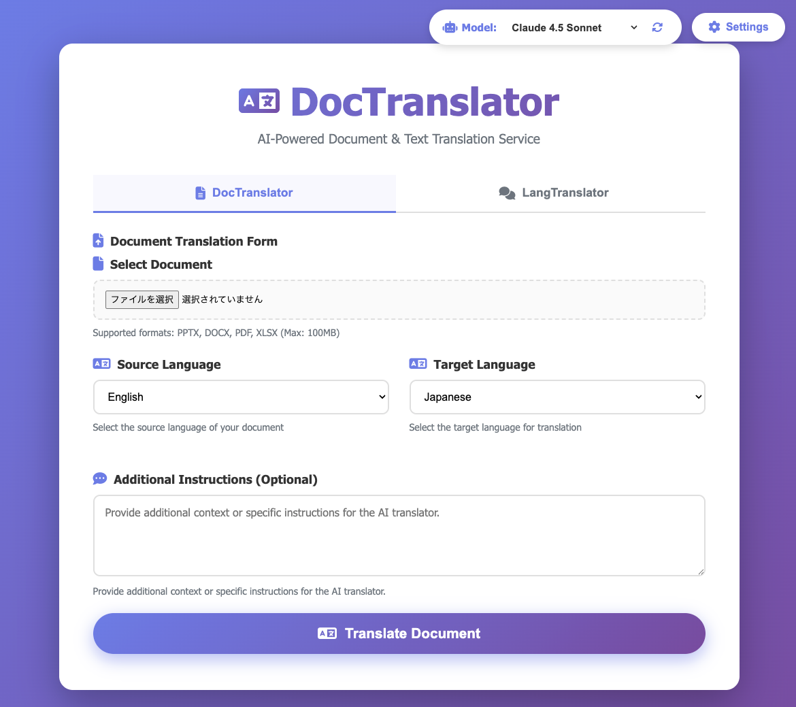
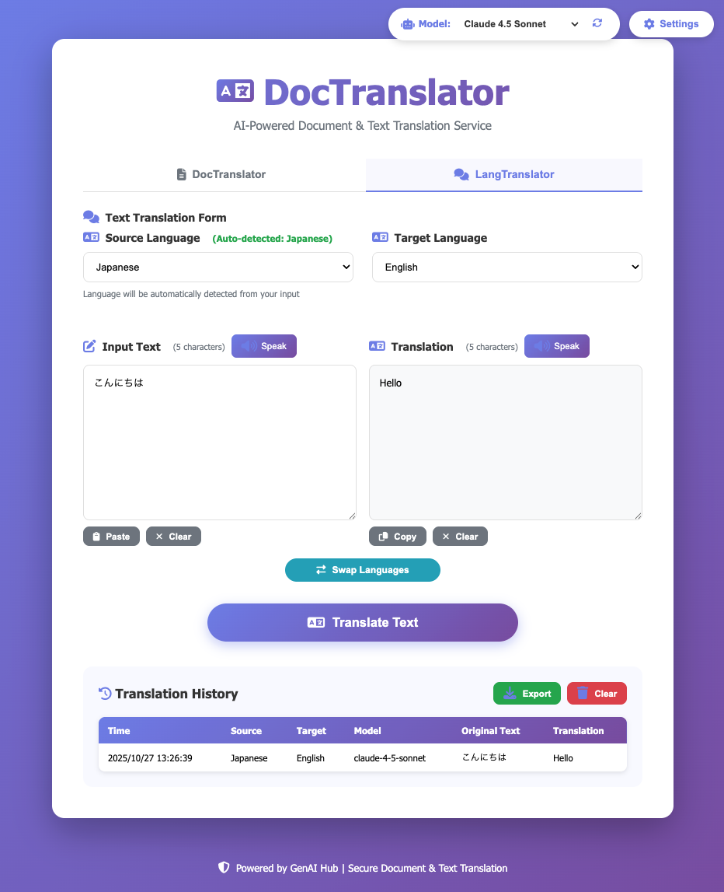

了解しました。必要最低限の修正版を作成します：

```markdown
# DocTranslator / LangTranslator

DocTranslator / LangTranslatorは、GenAI HUB APIを使用してテキスト翻訳や、PowerPoint (.pptx)、Word (.docx)、Excel (.xlsx)、PDFファイルを翻訳するウェブベースの翻訳サービスです。

## 🎯 2つの翻訳モード

### 📄 ドキュメント翻訳 (DocTranslator)
- PPTX、DOCX、XLSX、PDFファイルの翻訳
- 元の書式・レイアウトを維持

### 💬 テキスト翻訳 (LangTranslator)
- リアルタイムテキスト翻訳
- **言語自動検出機能** 🔍
- 音声読み上げ機能 🔊
- 翻訳履歴の保存・エクスポート（CSV形式、UTF-8 BOM付き）

## UI スクリーンショット

### API設定画面（初回起動時）


### メインUI画面(文書翻訳モード)


### メインUI画面(テキスト翻訳モード)


## 🚀 機能

- 📄 **翻訳サイトのようなUI**: 一般的な翻訳サイトと同じようなUI
- 📄 **マルチフォーマットサポート**: PPTX、DOCX、XLSX、PDFファイルを翻訳
- 🤖 **AI搭載**: GenAI HUB で利用可能なモデル
- 🌐 **Webインターフェース**: リアルタイム進捗表示のクリーンで応答性の高いUI
- ⚡ **PDF処理**: 高品質PDF変換のためのLibreOffice統合
- 🐳 **コンテナ化**: Dockerによる簡単な開発とデプロイ

## 🎯 サポート言語

- 英語 (en)
- 日本語 (ja)
- 韓国語 (ko)
- 中国語 (zh)
- フランス語 (fr)
- ドイツ語 (de)
- スペイン語 (es)
- ヒンディー語 (hi)
- ベトナム語 (vi)
- タイ語 (th)

## 📋 必要なもの

### 必須ソフトウェア
- Docker (Rancher Desktop など)
- GenAI Hub API URL
- GenAI Hub API キー

## 🚀 クイックスタート（利用者向け）

### GitHub Container Registry からのイメージ利用

1. **Dockerイメージのプル**:
```bash
docker pull ghcr.io/kotaokayama/doctranslator:latest
```

2. **コンテナの起動**:
```bash
docker run -d -p 8000:8000 --name doctranslator ghcr.io/kotaokayama/doctranslator:latest
```
- アプリケーションにアクセスするポートを変更する場合は左側のポート番号（ホスト側）のみを変更してください

3. **アプリケーションへのアクセス**:
- ブラウザで http://localhost:8000 を開く
- 初回起動時にAPI キーとAPI URLを設定

4. **コンテナの停止**:
```bash
docker stop doctranslator
```

5. **コンテナの起動(2回目以降)**:
```bash
docker start doctranslator
```

### Docker Composeを使用する場合（推奨）

1. **docker-compose.ymlファイルの作成**:
```yaml
version: '3.8'

services:
  doctranslator:
    image: ghcr.io/kotaokayama/doctranslator:latest
    container_name: doctranslator
    ports:
      - "8000:8000"
    volumes:
      - ./uploads:/app/uploads
      - ./downloads:/app/downloads
      - ./logs:/app/logs
      - doctranslator-data:/app/data  # データベース永続化
    restart: unless-stopped
    environment:
      - TZ=Asia/Tokyo

volumes:
  doctranslator-data:
```

2. **コンテナの起動**:
```bash
docker-compose up -d
```

3. **アプリケーションへのアクセス**:
- ブラウザで http://localhost:8000 を開く
- 初回起動時にAPI キーとAPI URLを設定

## 🚀 クイックスタート（開発者向け）

### Docker使用（推奨）

1. **リポジトリのクローン**:
```bash
git clone https://github.com/kotaokayama/DocTranslator.git
cd DocTranslator
```

2. **環境変数の設定**:
```bash
cp .env.example .env
# .envを編集し、必要に応じてデバッグ設定などを変更
# API KeyとAPI URLは初回起動時にUIから設定可能
```

3. **アプリケーションの起動**:
```bash
# Dockerイメージのビルド
docker-compose -f docker-compose.dev.yml build

# アプリケーションの起動
docker-compose -f docker-compose.dev.yml up

# または、makeコマンドを使用
make start
```

4. **アプリケーションへのアクセス**:
- ブラウザで http://localhost:8000 を開く
- 初回起動時にAPI キーとAPI URLを設定

### ローカルインストール

1. **クローンとセットアップ**:
```bash
git clone https://github.com/kotaokayama/DocTranslator.git
cd DocTranslator
```

2. **仮想環境の作成**:
```bash
python -m venv venv
source venv/bin/activate  # Windows: venv\Scripts\activate
```

3. **依存関係のインストール**:
```bash
pip install -r requirements.txt
pip install -r requirements-dev.txt
```

4. **環境設定**:
```bash
cp .env.example .env
# .envを編集（必要に応じて）
```

5. **サーバーの起動**:
```bash
uvicorn app.main:app --reload
```

## 📁 プロジェクト構造

```
DocTranslator/
├── app/                          # アプリケーションコード
│   ├── main.py                   # FastAPIアプリケーション本体
│   ├── config.py                 # API設定管理
│   ├── init_db.py                # データベース初期化
│   ├── schema.sql                # データベーススキーマ
│   ├── core/                     # コアビジネスロジック
│   │   ├── translator.py         # 文書翻訳ロジック
│   │   └── text_translator.py    # テキスト翻訳ロジック
│   ├── static/                   # 静的ファイル
│   │   ├── css/style.css
│   │   ├── js/app.js
│   │   ├── index.html
│   │   └── favicon.svg
│   └── utils/                    # ユーティリティ関数
│       └── language_detector.py  # 言語自動検出（テキスト翻訳専用）
├── docker/                       # Docker設定
│   ├── Dockerfile                # 本番用
│   └── Dockerfile.dev            # 開発用
├── tests/                        # テストファイル
├── downloads/                    # ダウンロードファイル
├── uploads/                      # アップロードファイル
└── logs/                         # ログファイル
```

## 🧪 テスト

### テストの実行
```bash
# すべてのテストを実行
make test

# 特定のテストファイルを実行
pytest tests/unit/test_translator.py

# カバレッジレポート付きで実行
pytest --cov=app tests/ --cov-report=html

# Dockerでテストを実行
docker-compose -f docker-compose.dev.yml exec document-translator pytest
```

## 🔧 設定

### 環境変数

`.env`ファイルで環境変数を管理します：

- `GENAI_HUB_API_KEY`: API キー（UIから設定可能）
- `GENAI_HUB_API_URL`: API URL（UIから設定可能）
- `DEBUG`: デバッグモードの有効化（デフォルト: false）
- `LOG_LEVEL`: ログレベル（デフォルト: INFO）
- `MAX_FILE_SIZE`: 最大アップロードファイルサイズ（デフォルト: 100MB）
- `UPLOAD_TIMEOUT`: アップロードタイムアウト（秒）（デフォルト: 300）

### Docker設定

開発環境:
```bash
# Dockerイメージのビルド
docker-compose -f docker-compose.dev.yml build

# アプリケーションの起動
docker-compose -f docker-compose.dev.yml up
```

本番環境:
```bash
# Dockerイメージのビルド
docker-compose build

# アプリケーションの起動
docker-compose up
```

## 🐛 トラブルシューティング

### 一般的な問題

1. **API設定の問題**:
- API KeyとAPI URLが正しく設定されているか確認
- API Keyの権限を確認
- API URLが正しいフォーマットであることを確認（例: https://api.anthropic.com/v1/chat/completions）

2. **PDF変換の失敗**:
- LibreOfficeがインストールされていることを確認
- ログで具体的なエラーを確認
- ファイル権限を確認

3. **Docker関連の問題**:
- Docker Desktopが起動していることを確認
- コンテナのログを確認
- コンテナの再ビルドを試す

4. **テキスト翻訳の言語自動検出が動作しない**:
- 十分な長さのテキストを入力（最低10文字以上推奨）
- ブラウザのコンソールでエラーを確認（F12キー）

5. **音声読み上げが動作しない**:
- ブラウザが音声合成APIをサポートしているか確認（Chrome、Firefox、Safari、Edgeの最新版）
- 該当言語の音声がシステムにインストールされているか確認

### デバッグ

1. **ログの表示**:
```bash
# Dockerログ
docker-compose -f docker-compose.dev.yml logs -f

# アプリケーションログ
tail -f logs/app.log
```

2. **コンテナステータスの確認**:
```bash
docker-compose -f docker-compose.dev.yml ps
```

## 📜 ライセンス

このプロジェクトはMITライセンスの下で公開されています。詳細はLICENSEファイルを参照してください。

## 👥 コントリビューション

1. **新しいブランチの作成**:
```bash
git checkout -b feature/新機能名
```

2. **変更の実施**:
- コーディングスタイルに従う
- 新機能のテストを追加
- ドキュメントを更新

3. **変更のテスト**:
```bash
make test
make lint
make format
```

4. **プルリクエストの提出**:
- 変更点を説明
- 関連する課題を参照
- チームメンバーにレビューを依頼

## 📞 サポート

問題が発生した場合は、GitHubのIssueを作成してください。